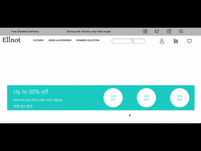

<div align="center">

# Full Stack E-Commerce Application

  <p>
Ellnot is a fully functional online shop that supports user accounts, filtered products functionality,an active search bar option, a wishlist, and a basket component for an indivdual account where you can proceed with sample payments. Prototypes and the initial design phase was done on Figma and every component is mobile friendly.
  </p>
  
<!-- Badges -->
<a href="https://airbnb-sclone.vercel.app" target="_blank"></a>


<h4>
    <a href="https://ellnot-shop.onrender.com/">View Demo</a>
  <span> · </span>
    <a href="https://github.com/SashenJayathilaka/Airbnb-Build/blob/master/README.md">Documentation</a>
  <span> · </span>
    <a href="https://github.com/SashenJayathilaka/Airbnb-Build/issues">Report Bug</a>
  <span> · </span>
    <a href="https://github.com/SashenJayathilaka/Airbnb-Build/issues">Request Feature</a>
  </h4>
</div>

<br />

<!-- About the Project -->

## :star2: About the Project

<!--Purpose-->

### Purpose

After following a software development coding Bootcamp in Edinburgh (ITPT), Ellnot meant to be my final project and ended upbeing more demanding that I anticipated as I decided to use React on the front-end for the first time.

Being the designer and using Figma in order to create a number of prototypes was time consuming but it proved to be beneficial as I moved on to the development phase. The idea was to try and implement as many features possible, but the one that I found particularly challenging was creating a functional search bar.

<!-- Screenshots -->

### :camera: Screenshots

- Main page, navigation bar, search bar and options for filtered data included

<div align="center">
<a href="https://ellnot-shop.onrender.com/"></a>
</div>

<br />

- New user functionality. App supports unique basket and wishlist for individual users.

<div align="center">
<a href="https://ellnot-shop.onrender.com/"></a>
</div>

## <a href="https://airbnb-sclone.vercel.app" target="_blank">LIVE DEMO 💥</a>


## Tech-stack

#### Client

- HTML
- CSS
- SASS
- Javascript
- React
- Stripe

#### Server

- Node.js
- Express
- Mongo.db
- Mongoose

<br />

<table>
    <tr>
        <td>
<a href="#"></a>
        </td>
                <td>
<a href="#"></a>
        </td>
                        <td>
<a href="#"></a>
        </td>
                              <td>
<a href="#"></a>
        </td>
                        <td>
<a href="#"></a>
        </td>
                                <td>
<a href="#"></a>
        </td>
                                      <td>
<a href="#"></a>
        </td>
      <td>
<a href="#"></a>
        </td>
    </tr>
</table>

## :toolbox: Getting Started

### :bangbang: Prerequisites

- Install Node JS in your computer <a href='https://nodejs.org/en/'>HERE</a>

<!-- Env Variables -->

### :key: Environment Variables

To run this project, you will need to add the following environment variables to your .env file

`REACT_APP_CLIENT_URL`

`REACT_APP_BACKEND_URL`

`REACT_APP_ENV`

<!-- Run Locally -->

### :running: Run Locally


Clone the project into desired folder

```bash
  git clone https://github.com/tneos/ellnot-online.git
```

move into project directory

```bash
  cd ellnot-online
```

change directory

```bash
  cd client
```

Install dependencies

```bash
  npm install
```

chang directory

```bash
  cd ..
```

change directory

```bash
  cd backend-api
```

Install dependencies

```bash
  npm install
```

Start the server

```bash
  npm run dev
```

<hr />

Open [http://localhost:3000](http://localhost:3000) with your browser to see the result.
